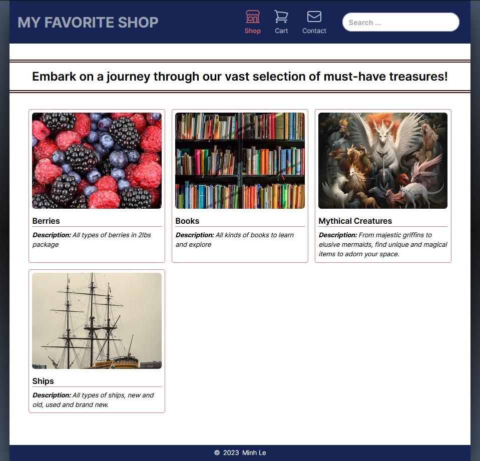

# My Favorite Shop - Third Iteration

In this third iteration, I have renamed the store to "My Favorite Shop" to give it a more general appeal. There is another version of the app, still titled "Nail Supply Shop," but it is set to private because I plan to use it to develop an actual nail store. 

Regarding styles, I switched from SCSS and CSS Modules to Tailwind CSS and found it to be incredibly appealing.

Additionally, I have isolated the admin panel into a separate app, which you can find [here](https://github.com/ledminh/my-favorite-shop-admin).

## Technology Stack

- **Framework:** Next.js
- **Database:** Prisma, PostgreSQL
- **Authentication:** Clerk
- **Styles:** Tailwind CSS

## Screenshot


## Live Demo

You can explore the live demo of this iteration by following [this link](https://my-favorite-shop.vercel.app).

For your amusement, I've transformed it into a fantasy shop that offers mythical creatures and fictional books. Please refrain from using your actual credit card for checkout, as no real transactions will take place. Instead, you can use the following credit card information: 

- Credit Card Number: 4242 4242 4242 4242
- Any CVC (as long as the expiration date is set in the future)


## Deployment Instructions

To deploy this project on your local machine, follow these steps:

1. Clone this project to your computer:

   ```sh
   git clone https://github.com/ledminh/nail-supply-shop-v2
   ```

2. Install dependencies:

   ```sh
   npm install
   ```
  
3. Set up your PostgreSQL database or sign up for one (I recommend using supabase.com). Obtain the database URL and add it to the variable DATABASE_URL in the `.env` file located at the root of your project (same level as the `src` folder).

4. Create a new storage in your Supabase account and add the following variables to the `.env.local` file located at the root of your project:

   - SUPABASE_STORAGE_URL: You can find this value by following these steps: After logging into your Supabase dashboard, click on "Settings" in the side menu, then navigate to "API." The value is located in the "Project URL" section.
   - SUPABASE_API_KEY: The value can be found in the "Settings" > "API" > "Project API keys" section.

5. Within your newly created storage, create a new bucket named "images." Inside this bucket, create two folders: "category" and "product."

6. Add SUPABASE_IMAGE_URL to the `.env.local` file. This URL typically follows this format: `https://your-host-name.supabase.co/storage/v1/object/public/your-storage-name`.

7. Create a new account on Stripe to obtain STRIPE_SECRET_KEY and NEXT_PUBLIC_STRIPE_PUBLIC_KEY. Ensure that you set it to "Test mode" so that you can utilize the credit card number 4242 4242 4242 4242 for testing the checkout feature.

8. Since this project uses Next.js, the remaining deployment process is similar to any other Next.js app. You can run the development server with the following command:

      ```sh
      npm run dev
      ```

9. If you intend to deploy it to your own server, follow these steps:

   - Build the project:

     ```sh
     npm run build
     ```

   - Start the server:

     ```sh
     npm run start
     ```
   
## Continuing Development

Here's a list of tasks for the ongoing development of this project:

- Implement a customer login feature.
- Set up email confirmation for customers after checkout.
- Enhance the user interface.
- Incorporate additional animations to improve the user experience.


## Other Iterations:

- [Nail Supply Shop v1](https://github.com/ledminh/nail-supply-shop)
- [Nail Supply Shop v2](https://github.com/ledminh/nail-supply-shop-v2)
